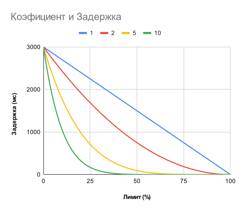
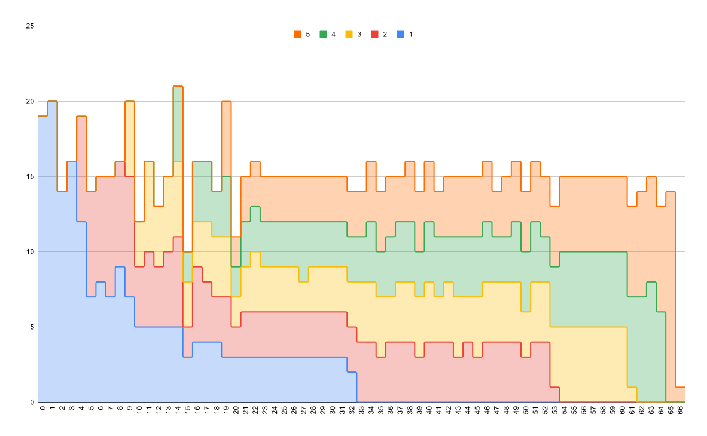

# moysklad-fetch-planner <!-- omit in toc -->

[](https://www.npmjs.com/package/moysklad-fetch-planner)
[](https://github.com/wmakeev/moysklad-fetch-planner/actions/workflows/main.yml)
[](https://app.codecov.io/gh/wmakeev/moysklad-fetch-planner/tree/master/)


> Планировщик запросов для API МойСклад

Позволяет выполнять асинхронные запросы к МойСклад без опасения получить ошибку превышения лимитов - `429 Too Many Requests`.

Чтобы уложиться в доступные лимиты полученные из заголовков ответа сервера (напр. `X-RateLimit-Limit` и `X-RateLimit-Remaining`), планировщик автоматически вносит задержку между выполнением отдельных запросов, а так же регулирует максимальное кол-во параллельных запросов. Прозрачно выполняет повтор запроса если ошибки избежать не удалось.

Такой подход позволяет обеспечить быстрое выполнение запросов с минимальной задержкой в моменте и стабильную работу при длительной высокой нагрузке, в том числе, при наличии задач в других процессах, разделяющих с вашим приложением общий лимит.

## Содержание <!-- omit in toc -->

- [Быстрый старт](#быстрый-старт)
  - [С использованием fetch](#с-использованием-fetch)
  - [С использованием библиотеки moysklad](#с-использованием-библиотеки-moysklad)
- [Принцип работы](#принцип-работы)
  - [Параллельные запросы](#параллельные-запросы)
- [Конфигурация](#конфигурация)
  - [Обработчик событий `eventHandler`](#обработчик-событий-eventhandler)
  - [Коэффициент тротлинга `throttlingCoefficient`](#коэффициент-тротлинга-throttlingcoefficient)
    - [Рекомендации](#рекомендации)
  - [Максимальное кол-во параллельных запросов `maxParallelLimit`](#максимальное-кол-во-параллельных-запросов-maxparallellimit)
  - [Максимальное время задержки между запросами `maxRequestDelayTimeMs`](#максимальное-время-задержки-между-запросами-maxrequestdelaytimems)
  - [Jitter `jitter`](#jitter-jitter)
  - [Период пересмотра параллельных запросов `parallelLimitCorrectionPeriodMs`](#период-пересмотра-параллельных-запросов-parallellimitcorrectionperiodms)
- [Использование](#использование)
  - [Создание экземпляра планировщика](#создание-экземпляра-планировщика)
  - [wrapFetch(fetch, options)](#wrapfetchfetch-options)
- [Методы FetchPlanner](#методы-fetchplanner)
  - [getFetch()](#getfetch)
  - [waitForFreeRequestSlot(priority)](#waitforfreerequestslotpriority)
  - [getOptions()](#getoptions)
  - [getRateLimit()](#getratelimit)
  - [getRateLimitRemaining()](#getratelimitremaining)
  - [getActionsQueueLength()](#getactionsqueuelength)
  - [getRequestSlotHandlersCount()](#getrequestslothandlerscount)
  - [getParallelLimitCorrection()](#getparallellimitcorrection)
  - [getCurInflightRequestsCount()](#getcurinflightrequestscount)
  - [getLastRequestDelay()](#getlastrequestdelay)
  - [getNextRequestTime()](#getnextrequesttime)
- [События](#события)
  - [Подписка на события](#подписка-на-события)
  - [Виды событий](#виды-событий)
    - [`request` - отправка запроса](#request---отправка-запроса)
    - [`response` - получение ответа](#response---получение-ответа)
- [Пример: Разделение лимита между разными процессами](#пример-разделение-лимита-между-разными-процессами)

## Быстрый старт

### С использованием fetch

```ts
import { wrapFetch } from 'moysklad-fetch-planner'

const wrappedFetch = wrapFetch(fetch)

const result = await wrappedFetch(
  'https://api.moysklad.ru/api/remap/1.2/entity/customerorder?limit=100',
  {
    headers: {
      'Authorization': '...'
      'Accept-Encoding': 'gzip'
    }
  }
)

console.log(`Номер первого заказа - ${result.rows[0].name}`)
```

### С использованием библиотеки [moysklad](https://github.com/wmakeev/moysklad)

```ts
import Moysklad from 'moysklad'
import { wrapFetch } from 'moysklad-fetch-planner'

// Логин и пароль указаны в переменных окружения
const ms = Moysklad({ fetch: wrapFetch(fetch) })

const result = await ms.GET('entity/customerorder', { limit: 100 })

console.log(`Номер первого заказа - ${result.rows[0].name}`)
```

## Принцип работы

При создании экземпляра планировщика передается объект с интерфейсом [Fetch API](https://developer.mozilla.org/en-US/docs/Web/API/Window/fetch).

> Начиная с версии Node.js 18+ [fetch](https://nodejs.org/docs/latest/api/globals.html#fetch) входит в стандартную библиотеку и доступен в глобальной области видимости.

```ts
const fetchPlanner = new FetchPlanner(fetch)
```

Создается прокси-метод для fetch с тем же интерфейсом, но с поддержкой планирования запросов к API МойСклад.

```ts
const wrappedFetch = fetchPlanner.getFetch()
```

Все запросы отправленные через обернутый fetch попадают в планировщик и добавляются в очередь. При наличия свободного лимита, запрос извлекается из очереди и выполняется.

Текущий доступный лимит определяется из соответствующих [HTTP заголовков](https://dev.moysklad.ru/doc/api/remap/1.2/index.html#mojsklad-json-api-obschie-swedeniq-obrabotka-oshibok:~:text=%D0%BF%D0%BE%D0%BC%D0%BE%D1%89%D1%8C%D1%8E%20%D1%81%D0%BB%D0%B5%D0%B4%D1%83%D1%8E%D1%89%D0%B8%D1%85%20%D0%B7%D0%B0%D0%B3%D0%BE%D0%BB%D0%BE%D0%B2%D0%BA%D0%BE%D0%B2-,X%2DRateLimit%2DLimit,-%2D%20%D0%BA%D0%BE%D0%BB%D0%B8%D1%87%D0%B5%D1%81%D1%82%D0%B2%D0%BE%20%D0%B7%D0%B0%D0%BF%D1%80%D0%BE%D1%81%D0%BE%D0%B2%2C%20%D0%BA%D0%BE%D1%82%D0%BE%D1%80%D1%8B%D0%B5) в ответах сервера API МойСклад.

Планировщик автоматически рассчитывает задержку для каждого отдельного запроса которая нужна для того, чтобы не превышать указанные лимиты.

> Первые запросы отправленные в планировщик, вплоть до получения первого ответа в заголовках которого содержится информация о лимитах, выполняются без задержки.

Задержка динамически меняется в зависимости от размера доступного лимита. Если лимит близок к 100%, то задержка минимальна и начинает расти с уменьшением лимита, достигая [максимального значения](#максимальное-время-задержки-между-запросами-maxrequestdelaytimems) при 0% от лимита.

В случае, если ошибка `429 Too Many Requests` всё же произошла, планировщик возвращает запрос обратно в начало очереди и повторяет его в штатном режиме согласно описанной логике.

### Параллельные запросы

Помимо лимита на кол-во запросов за единицу времени (RateLimit), МойСклад имеет лимит на кол-во параллельных запросов. Текущее кол-во выполняемых параллельных запросов не возвращается в ответе сервера API МойСклад. Поэтому планировщик может сделать вывод о превышении этого лимита только по факту получения ошибки `429 Too Many Requests` со значением `429005` в заголовке `X-Lognex-Auth`.

При каждой такой ошибке, максимальное допустимое кол-во параллельных запросов снижается на единицу вплоть до `1`.

Через [определенное время](#период-пересмотра-параллельных-запросов-parallellimitcorrectionperiodms) происходит пересмотр значения максимального значения параллельных запросов. И если за это время ошибка не повторялась, то значение снова увеличивается на `1`, постепенно восстанавливаясь до [максимума](#максимальное-кол-во-параллельных-запросов-maxparallellimit).

## Конфигурация

Для тонкой настройки планировщика можно передавать опции:

```ts
const wrappedFetch = wrapFetch(fetch, options)
```

или

```ts
const fetchPlanner = new FetchPlanner(fetch, options)
```

Параметры `options` (все опциональны):

### Обработчик событий `eventHandler`

Должен соответствовать следующему минимальному интерфейсу:

```typescript
interface EventHandler {
  emit(eventName: string, data?: any): void
}
```

Можно использовать для логирования, сбора статистики и анализа нагрузки
на API.

[Подробнее в разделе "События"](#события)

### Коэффициент тротлинга `throttlingCoefficient`

**По умолчанию:** `5` (допускается значение от 1 до 20)

Коэффициент регулирующий интенсивность тротлинга запросов в зависимости от доступных в текущий момент лимитов.

> Процент оставшегося лимита запросов можно рассчитать как отношение значений в заголовках ответа API `X-RateLimit-Remaining` к `X-RateLimit-Limit`.

При минимальном значении коэффициента `throttlingCoefficient` равном `1` задержка нарастает линейно от `0` мс при 100% лимита до `maxRequestDelayTimeMs` мс при 0% лимита. При значении коэффициента больше `1`, задержка начинает нарастать нелинейно, уменьшая задержку при лимитах близких к 100% и увеличивая при уменьшении лимита. Например если коэффициент равен `10`, то тротлинга практически не будет вплоть до ~30% от лимита, а далее начнется резкое увеличение задержки до `maxRequestDelayTimeMs`.

На иллюстрации пример зависимости размера задержки от лимита при различных коэффициентах:



#### Рекомендации

- Если известно, что приложение будет работать в окружении других параллельных задач, разделяющих между собой лимит запросов, то имеет смысл установить меньший коэффициент в диапазоне от 1 до 4.

- Если приложение самостоятельно разделяет доступные лимиты и важна максимальная производительность для серий последовательных запросов, когда задержка минимальна в первые секунды и начинает нарастать уже при сохранении нагрузки, то можно увеличивать коэффициент.

Важно понимать, что, вне зависимости от размера коэффициента, при постоянной интенсивной нагрузке на API задержка всегда выходит на одно и то же среднее значение примерно равное отношению `X-Lognex-Retry-TimeInterval` / `X-RateLimit-Limit` (~66 мс).

### Максимальное кол-во параллельных запросов `maxParallelLimit`

**По умолчанию:** `4` (максимальное значение для МойСклад `5`)

API МойСклад позволяет до 5 параллельных запросов, но для большей надежности лучше оставлять небольшой запас. Планировщик умеет определять ситуации, когда приложение сталкивается с лимитом на кол-во параллельных запросов, постепенно уменьшая указанный лимит. Но если на одном аккаунте работает много приложений или приложение интенсивно использует API, то лучше сразу явно ограничить кол-во параллельных запросов до 2-3 или даже меньше.

### Максимальное время задержки между запросами `maxRequestDelayTimeMs`

**По умолчанию:** `3000` (3 секунды)

Максимальное время задержки перед выполнением следующего запроса.

Устанавливается в случае когда оставшийся лимит равен нулю (либо произошла ошибка превышения лимита на кол-во запросов в единицу времени).

Такая ситуация может произойти если:

- работает слишком много параллельных приложений
- какое-либо параллельное приложение не контролирует лимиты

Задержка между запросами всегда лежит в диапазоне от 0 до `maxRequestDelayTimeMs`.

### Jitter `jitter`

**По умолчанию** `0.1` (максимальное значение `0.3`)

Доля от значения `maxRequestDelayTimeMs` в пределах которой будет случайным образом изменено значение `maxRequestDelayTimeMs` при расчете величины задержки между запросами.

Указание jitter'a (дрожания) способствует более равномерному распределению запросов при одновременной параллельной работе нескольких приложений.

Так же jitter применяется для расчета времени [коррекции кол-ва параллельных запросов](#период-пересмотра-параллельных-запросов-parallellimitcorrectionperiodms).

### Период пересмотра параллельных запросов `parallelLimitCorrectionPeriodMs`

**По умолчанию:** `10000` (10 секунд)

Период через которые происходим пересмотр допустимого кол-ва параллельных запросов.

Лимит уменьшается при каждой ошибке превышения кол-ва параллельных запросов с шагом `1`

Лимит постепенно увеличивается снова до `maxParallelLimit` с шагом `1` через указанный промежуток времени.

## Использование

Каждый отдельный экземпляр планировщика имеет независимую очередь запросов.

### Создание экземпляра планировщика

```js
import { FetchPlanner } from 'moysklad-fetch-planner'

const fetchPlanner = new FetchPlanner(fetch, {
  maxRequestDelayTimeMs: 1000
})

const wrappedFetch = fetchPlanner.getFetch()

const authHeader = 'Basic ' + Buffer.from(
  `${process.env.MOYSKLAD_LOGIN}:${process.env.MOYSKLAD_PASSWORD}`
).toString('base64')

const result = await wrappedFetch(
  'https://api.moysklad.ru/api/remap/1.2/customerorder?limit=100',
  {
    headers: {
      'Authorization': authHeader
      'Accept-Encoding': 'gzip'
    }
  }
)

console.log(`Номер первого заказа - ${result.rows[0].name}`)
```

### wrapFetch(fetch, options)

Сокращенный вариант - передать fetch в функцию wrapFetch, которая создаст экземпляр планировщика и вернет обернутый fetch.

**Параметры:**

- `fetch` - функция `fetch` с интерфейсом FetchAPI
- `options` - параметры [конфигурации](#конфигурация)

```js
import { wrapFetch } from 'moysklad-fetch-planner'

const wrappedFetch = wrapFetch(fetch, {
  maxRequestDelayTimeMs: 1000
})

// ... см. пример выше
```

## Методы FetchPlanner

### getFetch()

Возвращает обернутый fetch для выполнения запросов через планировщик. Исходный fetch передается в параметрах конструктора при создании экземпляра FetchPlanner.

### waitForFreeRequestSlot(priority)

Ожидание фактического наличия свободного слота для выполнения запроса.

Параметры:

- `priority` - Приоритет (`number`). Чем меньше число, тем раньше будет выделен слот (по умолчанию - `0`)

В примере ниже в цикле выполнятся сразу 100 запросов.

- Если поставить `await` перед `ms.GET(...)`, то все запросы будут выполнятся последовательно, что не подходит для ситуации когда задача выполнить запросы параллельно.

- Если убрать строку `await fetchPlanner.waitForFreeRequestSlot()`, то все 100 запросов сразу попадут в очередь планировщика, что не будет хорошим решением при большом кол-ве запросов.

- В данном случае с использованием `await fetchPlanner.waitForFreeRequestSlot()` запросы будут выполнятся параллельно, в то же время, не будут забивать очередь планировщика. И мы можем контролировать поток выполнения внутри цикла.

```js
const resultsPromises = []

for (let i = 1; i < 100; i++) {
  await fetchPlanner.waitForFreeRequestSlot()

  const resultsPromise = ms.GET('entity/product', {
    offset: Math.round(Math.random() * 100) + 1,
    limit: 1
  })

  resultsPromises.push(resultsPromise)
}

const results = await Promise.all(resultsPromises)
```

### getOptions()

Возвращает параметры планировщика по умолчанию либо указанные при его создании.

### getRateLimit()

Возвращает текущее актуальное значение заголовка `X-RateLimit-Limit`.

### getRateLimitRemaining()

Возвращает текущее актуальное значение заголовка `X-RateLimit-Remaining`.

### getActionsQueueLength()

Возвращает текущую длину очереди запросов.

### getRequestSlotHandlersCount()

Возвращает количество обработчиков ожидающих свободного слота.

### getParallelLimitCorrection()

Возвращает текущую коррекцию кол-ва допустимых параллельных запросов.

### getCurInflightRequestsCount()

Возвращает текущее кол-во незавершенных запросов (ожидающих ответа сервера)

### getLastRequestDelay()

Возвращает задержку последнего запроса (ms)

### getNextRequestTime()

Возвращает время мс (Unix Timestamp) на которое запланирован следующий запрос или `0`, если нет запланированных запросов.

## События

### Подписка на события

Пример подписки на события планировщика:

```js
import { EventEmitter } from 'node:events'
import { FetchPlanner, FetchPlannerEventMap } from 'moysklad-fetch-planner'

const eventHandler = new EventEmitter<FetchPlannerEventMap>()

eventHandler.on('request', function (ev, planner) {
  console.log(ev.actionId, planner.getRateLimit())
})

eventHandler.on('response', (ev, planner) => {
  console.log(ev.actionId, planner.getRateLimit())
})

const fetchPlanner = new FetchPlanner(fetch, {
  eventHandler
})
```

### Виды событий

#### `request` - отправка запроса

Содержит поля:

| Наименование | Тип                              | Описание                                                                                                          |
| ------------ | -------------------------------- | ----------------------------------------------------------------------------------------------------------------- |
| `actionId`   | `number`                         | Id задачи в планировщике.                                                                                         |
| `url`        | `string` или `URL` или `Request` | Url запроса.                                                                                                      |
| `requestId`  | `number`                         | Id отдельного запроса. Одна задача может выполнятся несколько раз при повторе в случае ошибки.                    |
| `startTime`  | `number`                         | [Время начала запроса](https://developer.mozilla.org/en-US/docs/Web/JavaScript/Reference/Global_Objects/Date/now) |

#### `response` - получение ответа

Содержит все поля из события `request` и дополнительно:

| Наименование   | Тип      | Описание                                                                                                                                                            |
| -------------- | -------- | ------------------------------------------------------------------------------------------------------------------------------------------------------------------- |
| `responseType` | `string` | Тип запроса. `OK` - успешный запрос; `RATE_LIMIT_OVERFLOW` - ошибка 429 TooManyRequests; `PARALLEL_LIMIT_OVERFLOW` - ошибка превышения лимита параллельных запросов |
| `endTime`      | `number` | Время получения ответа                                                                                                                                              |

## Пример: Разделение лимита между разными процессами

Алгоритм планировщика позволяет динамически управлять частотой запросов в зависимости от значения текущих лимитов API МойСклад. Поэтому даже при одновременной работе нескольких приложений в разных процессах нагрузка не будет превышать в среднем 15 запросов в секунду (в соответствии с лимитами API МойСклад - не более 45 запросов в течение 3-х секунд).

На графике, по собранной статистике из реального теста, видно как пять интенсивно выполняющих запросы приложений последовательно запускаются и завершаются в разных процессах и автоматически делят между собой доступный лимит.

По оси X время (кол-во секунд с момента запуска первого процесса), по оси Y кол-во запросов в секунду. Общая нагрузка, независимо от кол-ва работающих приложений, в любой момент времени соответствует ~15 запросам в секунду.



Отдельные пики при старте очередного приложения связаны с тем, что в момент запуска планировщик "не знает" о текущих лимитах и первые запросы выполняются без задержки.

Конечно, для достижения такого эффекта нужно чтобы каждое приложение работало через свой планировщик запросов.
